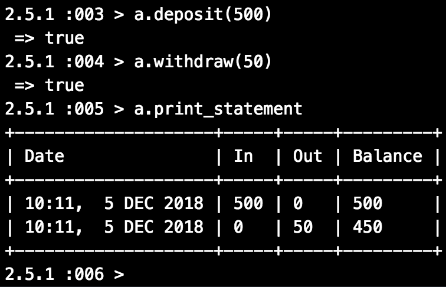

# Bank Tech Test

## Project Outline

You will be able to interact with this project, using a REPL, as if it were a bank. You should be able to make withdrawals, deposits and view a full bank statement which contains a full history of transactions.



## Approach

I began this project following my instinct to use one class, before splitting responsibilities into seperate classes for Account, Statement and Transaction.

### Account

This class is intended purely to act as the controller for the application. This should be the only component the client interacts with directly.
It initializes with variables `@balance = 0` and `@statement = Statement.new`
It contains methods:

```
deposit
```
takes argument `amount`
creates a new instance of Transaction, passing in `amount` and `@balance`
resets the value of `@balance` equal to the new balance returned by the `Transaction`
calls the statement method `new_row` passing in an array containing the time, money going in and out, and the total balance
traps any non-integer values being passed in, calls `string_error`

```
withdraw
```
more or less does the same as `deposit`, but instead passes the new `Transaction` a negative `amount` value

also traps any amount larger than the current balance being withdrawn to avoid a negative balance

```
print_statement
```
calls `@statement.diplay`, which returns a bank statement table in the terminal

### Transaction

Is only initialised with args `amount, balance`

Adds the value of `amount` to `@balance` on initialisation

### Statement

Initialises with a table, created with the [terminal-table](https://github.com/tj/terminal-table) gem, with the headers `Date`, `In`, `Out` and `Balance`

Contains methods:

```
new_row
```
takes in the array passed out by `Account.deposit` and `Account.withdraw` and adds these to the table in a new row, using terminal-tables `.add_row` method

```
display
```
prints out the table to the terminal

## User Stories

```
As a customer
So that I can keep my money safe
I want to deposit funds into an account
```

```
As a customer
So that I can access my money
I want to withdraw funds from my account
```

```
As a customer
So that I can keep an eye on my balance and transactions
I want to have access to a bank statement
```

## How to use:

Clone this repo

Open your terminal

Run the following commands:

```
irb
```

```
load 'lib/account.rb'
```

```
account = Account.new
```

To make a deposit:

```
account.deposit(integer)
```

To make a withdrawal:

```
account.withdraw(integer)
```

To display full bank statement:

```
account.print_statement
```

## How to run tests

Run:

```
rspec
```
